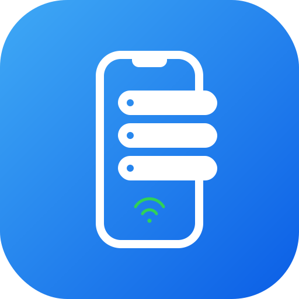
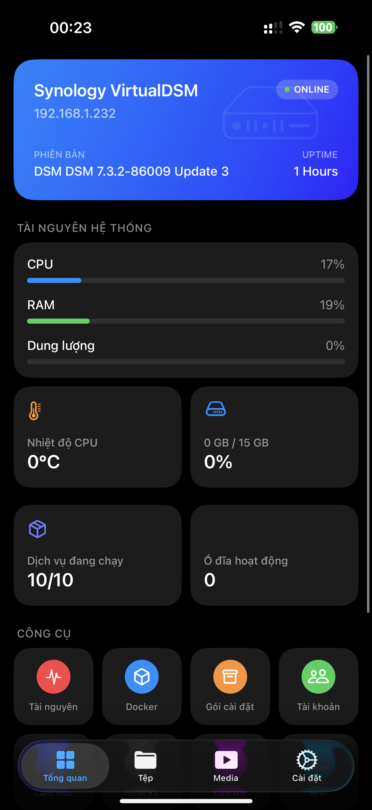
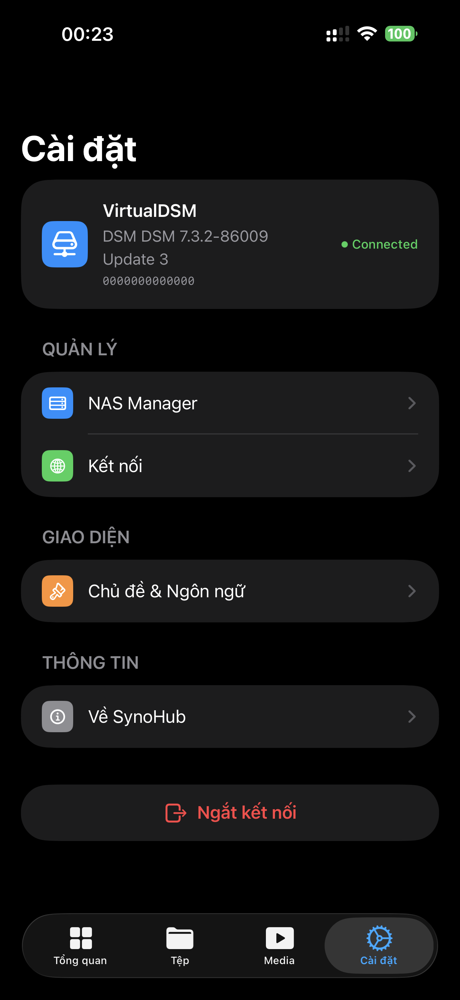
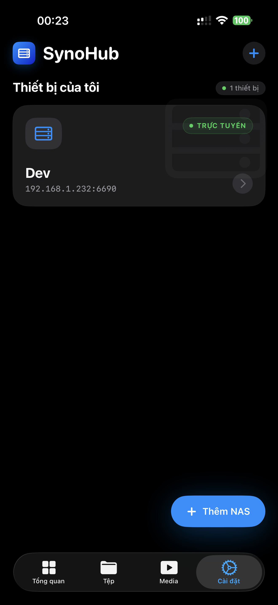

#  SynoHub iOS

<p align="center">
  
  
  
</p>

SynoHub là một ứng dụng native iOS hiệu năng cao được xây dựng độc quyền bằng SwiftUI để quản lý máy chủ Synology NAS của bạn. 
Được thiết kế tuân thủ nghiêm ngặt theo Apple Human Interface Guidelines (HIG), ứng dụng mang đến trải nghiệm cao cấp, mượt mà và liền mạch ngay trên iPhone và iPad.

## 🚀 Tính năng nổi bật

### 📡 Quản lý NAS (NAS Manager)
- **Thiết kế Thẻ Cao Cấp:** Layout dạng thẻ cuộn ngang hiện đại để quản lý nhiều máy chủ NAS.
- **Kết nối Thông minh:** Hỗ trợ HTTP, HTTPS và tự động phân giải Synology QuickConnect.
- **Trạng thái Thời gian thực:** Hiệu ứng đèn báo nhịp tim trực quan hiển thị trạng thái Online/Offline của thiết bị.

### 📊 Tổng quan & Giám sát Hệ thống
- **Hero Metrics:** Thiết kế thẻ thông tin phong cách "Apple Wallet" cho thông tin NAS.
- **Theo dõi Trực tiếp:** Trực quan hóa mức tiêu thụ CPU, RAM, sức khỏe ổ cứng và lưu lượng mạng.
- **Điều khiển Nhanh:** Các công cụ 1-chạm để Khởi động lại, Tắt nguồn ngay lập tức.

### 📁 Quản lý Tệp (Files)
- **Trải nghiệm Chuẩn iOS:** Lướt thư mục siêu mượt, thiết kế giao diện chuẩn ứng dụng Files của iOS với NavigationBar, Searchable, Context Menu và Swipe Actions.
- **Thao tác Thông minh:** Sao chép, di chuyển, đổi tên và xóa với phản hồi UI tức thì.
- **Tải lên & Chia sẻ:** Tải file từ iOS thẳng lên NAS, tạo liên kết chia sẻ bảo mật (hỗ trợ tạo mã QR).

### 🍿 Trung tâm Đa phương tiện (Media Center)
- **Giao diện Apple TV:** Giao diện xem phim tuyệt đẹp với Hero Section sinh động để hiển thị phim nổi bật.
- **Thư mục Thông minh:** Tự động phân loại phim, TV shows, video gia đình, âm nhạc với màu sắc và icon sinh động.
- **Trình phát Native:** Hỗ trợ AVPlayer tích hợp để stream video trực tiếp từ NAS mà không có độ trễ.

### 🖼 Ảnh (Photos)
- **Lưới Ảnh Thông minh:** Cuộn mượt mà vô hạn trên thư viện ảnh Synology.
- **Quản lý Album:** Thao tác trên album native ngay trong ứng dụng.

---

## 🗺 Lộ trình Phát triển (Roadmap)

Dự án đang liên tục được mở rộng với tầm nhìn trở thành hệ sinh thái toàn diện thay thế hoàn toàn các ứng dụng gốc của Synology:
- [**Trung tâm Đa phương tiện (Jellyfin/Plex-Inspired):**](docs/TODO_MediaCenter.md) Xây dựng thư viện phim thông minh với siêu dữ liệu từ TMDB, quản lý tiến trình xem và nâng cấp tính năng Player.
- [**Tích hợp File Provider Extension:**](docs/TODO_FileProvider.md) Gắn kết trực tiếp dữ liệu NAS vào ứng dụng **Files (Tệp)** gốc của hệ điều hành iOS/iPadOS, cho phép đồng bộ và chỉnh sửa tài liệu xuyên ứng dụng.
- [**Photos AI (Apple Intelligence & Core ML):**](docs/TODO_PhotosIntelligence.md) Tận dụng sức mạnh xử lý NPU trên thiết bị để nhận diện khuôn mặt, vật thể, tự động tạo Smart Albums, Memories và tìm kiếm ảnh bằng **Ngôn ngữ tự nhiên** hoàn toàn offline (Privacy-First).

---

## 🛠 Công nghệ sử dụng
- **Kiến trúc:** MVVM + Clean Architecture 
- **Giao diện (UI):** SwiftUI (Hỗ trợ iOS 16.0+)
- **Lưu trữ:** SwiftData & UserDefaults
- **Mạng (Networking):** Native URLSession (Async/Await) kết hợp Synology WebAPI
- **Đa phương tiện:** AVKit (AVPlayer)

## 📦 Cài đặt & Chạy ứng dụng

1. **Clone repository:**
   ```bash
   git clone https://github.com/phuctu1901/synohub-ios.git
   ```
2. **Mở dự án:**
   Mở file `SynoHubs/SynoHubs.xcodeproj` bằng Xcode 15 trở lên.
3. **Build & Chạy:**
   Chọn một thiết bị iOS Simulator hoặc thiết bị thật (iOS 16+) và nhấn `Cmd + R`.

---

## 🔒 Quyền riêng tư & Bảo mật
SynoHub kết nối *trực tiếp* tới Synology NAS của bạn bằng API chuẩn của Synology. Mọi thông tin đăng nhập đều được xử lý hoàn toàn cục bộ trên thiết bị và tuyệt đối **không** đi qua bất kỳ máy chủ trung gian nào.

## 📄 Giấy phép
Đây là phần mềm có bản quyền. Mọi quyền được bảo lưu.
